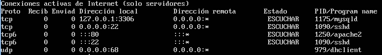

# Ejercicios #

## Universidad de Granada - ETSIIT ##
### Servidores Web de Altas Prestaciones ###

##### Manuel Mesas Gutiérrez

### Índice ###

- [Tema 1](#id1)
    - [Ejercicio](#id11)
- [Tema 2](#id2)
    - [Ejercicio 2.1](#id21)
    - [Ejercicio 2.2](#id22)
- [Tema 3](#id3)
    - [Ejercicio 3.1](#id31)
    - [Ejercicio 3.2](#id32)
- [Tema 4](#id4)
    - [Ejercicio 4.1](#id41)
    - [Ejercicio 4.2](#id42)
    - [Ejercicio 4.3](#id43)
    - [Ejercicio 4.6](#id46)
    - [Ejercicio 4.7](#id47)
- [Tema 5](#id5)
    - [Ejercicio 5.1](#id51)
    - [Ejercicio 5.2](#id52)
    - [Ejercicio 5.3](#id53)
- [Tema 6](#id6)
    - [Ejercicio 6.1](#id61)
    - [Ejercicio 6.2](#id62)
    - [Ejercicio 6.3](#id63)
- [Tema 7](#id7)
    - [Ejercicio 7.1](#id71)
    - [Ejercicio 7.2](#id72)
---

### Tema 1 
#### Ejercicio:
##### Buscar información sobre las tareas o servicios web para los que se usan más los programas que comentamos al principio de la sesión:

**Apache:** es usado principalmente para servir páginas web estáticas y dinámicas en la web. Muchas aplicaciones web están diseñadas asumiendo como ambiente de implantación a Apache, o que utilizarán características propias de este servidor web.

**Nginx:** se puede implementar para servir contenido HTTP dinámico en la red utilizando FastCGI, controladores SCGI para scripts, servidores de aplicaciones WSGI o módulos Phusion Passenger, y puede servir como un equilibrador de carga de software.

**thttpd:** El uso apropiado de esta herramienta es obtener velocidad en la transferencia de archivos y reducción de gastos innecesarios para funciones que no son requeridas en el servidor. Si bien se puede utilizar como un reemplazo simplificado para servidores con más funciones, _es especialmente adecuado para atender solicitudes de gran volumen de datos estáticos_, por ejemplo, como servidor de alojamiento de imágenes. Además, thttpd tiene una característica de aceleración del ancho de banda que permite al administrador del servidor limitar la tasa de bits máxima a la que se pueden transferir ciertos tipos de archivos

**Cherokee:** ha sido adoptado por numerosos fabricantes de dispositivos electrónicos y fabricantes de tecnología del "Internet de las Cosas", debido a que es un servidor web liviano,  de alto rendimiento / proxy inverso.

**Node.js:** Node.js se usa principalmente para construir programas de red como servidores web. Los desarrolladores pueden crear servidores altamente escalables sin utilizar el uso de subprocesos, mediante el uso de un modelo simplificado de programación basada en eventos que utiliza devoluciones de llamadas para indicar la finalización de una tarea. Node.js conecta la facilidad de un lenguaje de scripting (JavaScript) con el poder de la programación en red de Unix.

___

### Tema 2

#### Ejercicio T2.1:
##### Calcular la disponibilidad del sistema si tenemos dos réplicas de cada elemento (en total 3 elementos en cada subsistema).

Partimos de un sistema formado por Web, Applications, Database, DNS, Firewall, Switch, un Data Center e ISP con las siguientes disponibilidades:

- Web: 85%
- Applications: 90%
- Database: 99.9%
- DNS: 98%
- Firewall: 85%
- Switch: 99%
- Data Center: 99.99%
- ISP: 95%

Utilizamos la fórmula **As = Ac1 + (1-Ac1) * Ac2** que mide el porcentaje de mejora en la disponibilidad que se alcanza al replicar un elemento. Tenemos la siguiente disponibilidad al replicar por primera vez cada elemento:

- Web: 0.85 + (1-0.85) \* 0.85 = **0.9775** = **97.75%**
- Applications: 0.9 + (1-0.9) \* 0.9 = **0.99** = **99%**
- Database: 0.999 + (1-0.999) \* 0.999 = **0.9999999** = **99.99999%**
- DNS: 0.98 + (1-0.98) \* 0.98 = **0.9996** = **99.96%**
- Firewall: 0.85 + (1-0.85) \* 0.85 = **0.9775** = **97.75%**
- Switch: 0.99 + (1-0.99) \* 0.99 = **0.9999** = **99.99%**
- Data Center: 0.9999 + (1-0.9999) \* 0.9999 = **0.9999999** = **99.99999%**
- ISP: 0.95 + (1-0.95) \* 0.95 = **0.9975** = **99.75%**

**As = Ac1 \* Ac2 \* Ac3 \* ... * Acn**  mide la disponibilidad final de sistema con respecto a los compoentes que la forman. Replicando cada elemento una sola vez se obtiene la siguiente disponibilidad:
(0.9775 \* 0.99 \* 0.9999999 \* 0.9996 \* 0.9775 \* 0.9999 \* 0.9999999 \* 0.9975) \* 100 = **94.3%**

Si añadimos otra réplica tendremos:
- Web: 0.0.9775 + (1-0.9775) \* 0.85 = **0.996625** = **99.6625%**
- Applications: 0.99 + (1-0.99) \* 0.9 = **0.999** = **99.9%**
- Database: 0.9999999 + (1-0.9999999) \* 0.999 = **0.9999999999** = **99.99999999%**
- DNS: 0.9996 + (1-0.9996)\ * 0.98 = **0.999992** = **99.9992%**
- Firewall: 0.0.9775 + (1-0.9775) \* 0.85 = **0.996625** = **99.6625%**
- Switch: 0.9999 + (1-0.9999) \* 0.99 = **0.999999** = **99.9999%**
- Data Center: 0.9999999 + (1-0.9999999) \* 0.9999 = **0.9999999999** = **99.99999999%**
- ISP: 0.9975 + (1-0.9975) \* 0.95 = **0.999875** = **99.9875%**

Replicando cada elemento por segunda vez, finalmente tenemos una disponibilidad del:
(0.996625 \* 0.999 \* 0.9999999999 \* 0.999992 \* 0.996625 \* 0.999999 \* 0.9999999999 \* 0.999875) \* 100 =**99.213%**

#### Ejercicio T2.2: 
##### Buscar frameworks y librerías para diferentes lenguajes que permitan hacer aplicaciones altamente disponibles con relativa facilidad.

- **Microsoft Operations Framework (MOF)** para conseguir alta disponibilidad en productos y tecnologías de Microsoft.

- **IBM High Availability Cluster Multiprocessing** está orientado a correr en clusters con SO AIX Unix e IBM System p (Sistemas Operativos creados por IBM) y conseguir un cluster de multiprocesamiento de alta disponibilidad.
- **Linux-HA** es un framework para clusters de alta disponibilidad que usen Linux.

___

### Tema 3

#### Ejercicio T3.1:
##### Buscar con qué órdenes de terminal o herramientas gráficas  podemos configurar bajo Windows y bajo Linux el enrutamiento del tráfico de un servidor para pasar el tráfico desde una subred a otra.

- **Terminal**
  - **Linux:** [iptables](https://blog.desdelinux.net/redireccionar-trafico-iptables/).
  - **Windows:** [route](https://www.howtogeek.com/howto/windows/adding-a-tcpip-route-to-the-windows-routing-table/).

- **Herramienta gráfica**
 - **Linux:** [FirewallBuilder](https://www.howtoforge.com/configuring-source-and-destination-nat-with-firewall-builder).
 - **Windows:** [Servicios de enrutamiento](http://blogs.itpro.es/readyplayerone/2015/10/03/servicios-de-enrutamiento-en-windows-server-2016/).

#### Ejercicio T3.2:
##### Buscar con qué órdenes de terminal o herramientas gráficas  podemos configurar bajo Windows y bajo Linux el filtrado y bloqueo de paquetes.

- **Terminal**
  - **Linux:** [iptables](https://www.redeszone.net/gnu-linux/iptables-configuracion-del-firewall-en-linux-con-iptables/), [ufw](https://es.wikipedia.org/wiki/Uncomplicated_Firewall).
  - **Windows:** [netsh advfirewall firewall, netsh firewall](https://support.microsoft.com/es-es/help/947709/how-to-use-the-netsh-advfirewall-firewall-context-instead-of-the-netsh).

- **Herramienta gráfica**
- **Linux:** [Gufw](https://www.redeszone.net/gnu-linux/como-usar-gufw-el-firewall-de-linux/), [FirewallBuilder](http://rm-rf.es/gestion-grafica-de-firewalls-con-firewall-builder/).
- **Windows:** [Windows Firewall Defender --> Configuración avanzada](https://www.solvetic.com/tutoriales/article/3070-como-crear-reglas-firewall-windows-server-2016/). También se abre si ejecutamos en el terminal `wf.msc`.

### Tema 4
#### Ejercicio T4.1:
##### Buscar información sobre cuánto costaría en la actualidad un mainframe. Comparar precio y potencia entre esa máquina y una granja web de unas prestaciones similares
El último mainframe lanzado por IBM es el z14 del cual se desconoce el precio, pero se estima en torno a 100.000$. El desembolso inicial sería mayor que el necesario para una granja web, aunque el gasto energético y el espacio ocupado será menor. IBM nos promete una disponibilidad del 99,999%. Además cifra el 100% de los datos de bases de datos y aplicaciones. Por contra, es más difícilmente escalable y un fallo en la máquina nos dejaría sin poder servir a los clientes.

La conclusión final sería que para empresas grandes, los mainframes pueden ser muy útiles (sin despreciar las granjas web), pero para una mediana y pequeña empresa no tiene ningún sentido pagar por un mainframe, pues una granja web es suficientemente _"potente"_.

#### Ejercicio T4.2:
##### Buscar información sobre precio y características de balanceadores hardware específicos. Compara las prestaciones que ofrecen unos y otros.

  - **TP-Link TL-R470T+**
    - **Precio:** 44.15$
    - **Puertos:**
      - 1 puerto fijo WAN Ethernet
      - 1 puerto fijo LAN Ethernet
      - 3 Puertos cambiables Ethernet WAN / LAN
    - **Memoria:** 128MB
    - **Concurrencia:** 10,000 sesiones

  - **TP-LINK TL-R480T**
    - **Precio:** 75.59$
    - **Puertos:**
      - 1 puerto fijo WAN Ethernet
      - 1 puerto fijo LAN Ethernet
      - 3 Puertos cambiables Ethernet WAN / LAN
    - **Memoria:** 128MB
    - **Concurrencia:** 30,000 sesiones

  - **TL-ER6020**
    - **Precio:** 152.07$
    - **Puertos:**
      -  1 Puerto Gigabit WAN
      -  3 Puertos Gigabit LAN/WAN
      -  1 Puerto Gigabit LAN
    - **Memoria:** 256MB
    - **Concurrencia:** 40,000 sesiones

  - **F5 Networks LTM-2000s**
    - **Precio:** 17,995.00$
    - **Puertos:**
      - 8 puertos LAN
      - 2 puertos Fibra
    - **Memoria:** 8 GB
    - **Concurrencia:** 500,000 sesiones

  - **Citrix NetScaler MPX 10500 Enterprise Edition**
      - **Precio:** 46,020.00
      - **Puertos:**
      - 2 puertos 10GBASE-X SFP+ AND
      - 8 puertos 1000BASE-X SFP (fiber or copper)
    - **Memoria:** 16 GB
    - **Concurrencia:** 500,000

    - **Citrix NetScaler MPX 10500 Platinum Edition**
      - **Precio:** 71,500.00$
      - Las mismas características que el anterior, solo cambian software y soporte.

###### Especificaciones completas:

- **[TP-Link TL-R470T+](https://www.tp-link.com/es/products/details/cat-4910_TL-R470T+.html#specifications)**
- **[TP-LINK TL-R480T](https://www.tp-link.com/es/products/details/cat-4910_TL-R480T+.html#specifications)**
- **[TL-ER6020](https://www.tp-link.com/es/products/details/cat-4909_TL-ER6020.html#specifications)**
- **[F5 Networks LTM-2000s &&  F5 Networks LTM-2200s](https://worldtechit.com/f5-products/f5-big-ip-2000s-2200s-hardware-datasheet/)**
- **[Citrix NetScaler](https://www.citrix.com/content/dam/citrix/en_us/documents/data-sheet/netscaler-data-sheet.pdf)**

#### Ejercicio T4.3:
##### Buscar información sobre los métodos de balanceo que implementan los dispositivos recogidos en el ejercicio 4.2

_No hay datos disponibles._

#### Ejercicio T4.6:
##### Buscar información sobre los bloques de IP para los distintos países o continentes

Existen múltiples webs para comprobar nuestra IP, como la siguiente:

https://www.iplocation.net/

Además esta web nos ofrece un listado por paises de las direcciones IP:

https://lite.ip2location.com/ip-address-ranges-by-country

Existen además funciones (`PHP`, `Python`) para poder geolocalizar IP's. Por ejemplo, tenemos la función `GEO IP` de `PHP`:

http://php.net/manual/es/book.geoip.php

#### Ejercicio T4.7:
##### Buscar información sobre métodos y herramientas para implementar GSLB

**Métodos:** DNS Proxy y DNS Server.

___

### Tema 5

#### Ejercicio T5.1:
##### Buscar información sobre cómo calcular el número de conexiones por segundo.

Podemos comprobarlo con la siguiente orden:

- Para **HTTP**:

    netstat | grep http | wc -l

- Para **HTTPS**:

    netstat | grep :443 | wc -l

En ambos casos, debemos dividir el resultado entre el resultado del siguiente comando:

    netstat -s | grep connections\ established

Para hacer la comprobación en **apache** basta con ejecutar:

    apache2ctl status | grep request/sec

En **Nginx** tenemos que activar la recopilación de estadísticas en el fichero `nginx.conf`. Para ello debemos agregar el siguiente contenido:

    location /nginx_status {
        # Turn on stats
        stub_status on;
        access_log   off;
        # only allow access from 192.168.56.100;
        allow 192.168.56.100;
        # allow all;
        deny all;
    }

Donde `192.1685.56.100` es la IP a la que le permitimos el acceso a las estadísticas del servidor Nginx, en nuestro caso, la máquina administradora.

A continuación recargamos Nginx con el comando:

    service nginx reload

Ahora si en nuestro navegador ponemos:

    192.168.56.125/nginx_status

Entonces tendremos disponible en el navegador el número de conexiones abiertas, de conexiones aceptadas, manejadas, y peticiones manejadas. Si dividimos el número de peticiones manejadas entre el número de conexiones manejadas, tendremos el número de conexiones abiertas por segundo.

`Requests per connection = handles requests / handled connections`

#### Ejercicio T5.2:

##### Instalar wireshark y observar cómo fluye el tráfico de red en uno de los servidores web mientras se le hacen peticiones HTTP.

En este caso, he realizado el [Trabajo Wireshark](../Trabajo%20Wireshark/Wireshark.pdf) de la propia asignatura, con Raúl Del Pozo Moreno.

#### Ejercicio T5.3:

##### Buscar información sobre características, disponibilidad para  diversos SO, etc de herramientas para monitorizar las prestaciones de un servidor.

##### 1. top:

Si ejecutamos el comando `top`, nos va a aparecer una interfaz en modo texto que se va a ir actualizando cada 3 segundos. Muestra un resumen del estado de nuestro sistema y la lista de procesos que se están ejecutando.

En mi caso me ha mostrado esta salida en el terminal:

A continuación, vamos a realizar un breve análisis.

###### 1. Tiempo de actividad y carga media del sistema

Esta primera línea nos muestra:

  - Hora actual.
  - Tiempo que ha estado el sistema encendido.
  - Número de usuarios (mario y root).
  - Carga media en intervalos de 5, 10 y 15 minutos respectivamente.

###### 2. Tareas

La segunda línea muestra el total de tareas y procesos, los cuales pueden estar en diferentes estados.

  - **Ejecutar**(_Running_): procesos ejecutándose actualmente o preparados para ejecutarse.
  - **Hibernar**(_Sleeping_): procesos dormidos esperando que ocurra algo (depende del proceso) para ejecutarse.
  - **Detener**(_Stopped_): ejecución de proceso detenida.
  - **Zombie**: el proceso no está siendo ejecutado. Estos procesos se quedan en este estado cuando el proceso que los ha iniciado muere (padre).

###### 3. Estados de la CPU

Esta línea nos muestra los porcentajes de uso del procesador diferenciado por el uso que se le de.

  -  **Usuario**(*us*): tiempo de CPU de usuario.
  -  **Sistema**(*sy*): tiempo de CPU del kernel.
  -  **Adecuado**(*ni*):tiempo de CPU gastado en procesos de baja prioridad
  -  **Inactivo**(*inact*): tiempo de CPU en procesos inactivos.
  -  **En espera**(*wa*): tiempo de CPU en procesos en espera.
  -  **Interrupciones de hardware**(*hi*): interrupciones de hardware.
  -  **Interrupciones de software**(*si*): tiempo de CPU en interrupciones de software.

###### 4. Memoria física

  -  **Memoria total**(_total_).
  -  **Memoria libre**(_free_).
  -  **Memoria utilizada**(_used_).
  -  **Memoria utilizada por buffer/cache**(_buff/cache_).

###### 5. Memoria virtual

  -  **Memoria total**(_total_).
  -  **Memoria libre**(_free_).
  -  **Memoria utilizada**(_used_).
  -  **Memoria disponible**(_avail Mem_).

###### 6. Columnas

Ahora vamos a ver las diferentes columnas que nos encontramos al ejecutar el comando.

  -  **PID**: es el identificador de proceso. Cada proceso tiene un identificador único.
  -  **USUARIO**(_USER_): usuario propietario del proceso.
  -  **PR**: prioridad del proceso. Si pone RT es que se está ejecutando en tiempo real.
  -  **NI**: asigna la prioridad. Si tiene un valor bajo (hasta -20) quiere decir que tiene más prioridad que otro con valor alto (hasta 19).
  -  **VIRT**: cantidad de memoria virtual utilizada por el proceso.
  -  **RES**: cantidad de memoria RAM física que utiliza el proceso.
  -  **SHR**: memoria compartida.
  -  **S**(_ESTADO_): estado del proceso.
  -  **%CPU**: porcentaje de CPU utilizado desde la última actualización.
  -  **%MEM**: porcentaje de memoria física utilizada por el proceso desde la última actualización.
  -  **HORA+**(_TIME+_): tiempo total de CPU que ha usado el proceso desde su inicio.
  -  **COMMAND**: comando utilizado para iniciar el proceso.

##### 2. vmstat

###### 1. Comando `vmstat n`:
Recopila las estadísticas de memoria virtual mediante el comando  con un intervalo de tiempo n en segundos.

###### 2. Comando `vmstat -s`:
Muestra cuántos eventos del sistema se produjeron desde la última vez que se inició el sistema.

###### 3. Más opciones:

##### 3. netstat:

    netstat [-a] [-e] [-n] [-o] [-s] [-p PROTO] [-r] [interval]

  -  Cuando se utiliza con el argumento `-a`, el comando netstat muestra todas las conexiones y los puertos en escucha de la máquina.    
  -  Cuando se lo utiliza con el argumento `-e`, el comando netstat muestra las estadísticas Ethernet.    
  -  Cuando se lo utiliza con el argumento `-n`, el comando netstat muestra las direcciones y los números de puerto en forma numérica, sin resolución de nombres.    
  -  Cuando se lo utiliza con el argumento `-o`, el comando netstat indica el número del proceso asignado a la conexión.
  -  Cuando se lo utiliza con el argumento `-p` seguido del nombre del protocolo (TCP, UPD o IP), el comando netstat muestra la información solicitada relacionada con el protocolo especificado.    
  -  Cuando se lo utiliza con el argumento `-r`, el comando netstat muestra la tabla de enrutamiento.  
  -  Cuando se lo utiliza con el argumento `-s`, el comando netstat muestra las estadísticas detalladas para cada protocolo.    
  -  Por último, un intervalo opcional, `interval`, permite determinar el período de actualización de la información, en segundos. _El tiempo predeterminado es de 1 segundo._

##### 4. Otras herramientas de monitorización:

###### Zabbix:

Zabbix es un Sistema de Monitorización de Redes, diseñado para monitorizar y registrar el estado de varios servicios de red, Servidores, y hardware de red.

Zabbix ofrece varias opciones de monitorización:

  -  Chequeos simples que pueden verificar la disponibilidad y el nivel de respuesta de servicios estándar como SMTP o HTTP sin necesidad de instalar ningún software sobre el host monitorizado.
  -  Un agente Zabbix puede también ser instalado sobre máquinas UNIX y Windows para monitorizar estadísticas como carga de CPU, utilización de red, espacio en disco, etc.
  -  Como alternativa a instalar el agente sobre los host, Zabbix incluye soporte para monitorizar vía protocolos SNMP, TCP y ICMP, como también sobre IPMI, JMX, SSH, telnet y usando parámetros de configuración personalizados. Zabbix soporta una variedad de mecanismos de notificación en tiempo real, incluyendo XMPP.

Lanzado sobre los términos de la versión 2 de la GNU General Public License, Zabbix es Software Libre.

###### Nagios:

Nagios es un sistema de monitorización de redes ampliamente utilizado, de código abierto, que vigila los equipos (hardware) y servicios (software) que se especifiquen, alertando cuando el comportamiento de los mismos no sea el deseado. Entre sus características principales figuran la monitorización de servicios de red (SMTP, POP3, HTTP, SNMP...), la monitorización de los recursos de sistemas hardware (carga del procesador, uso de los discos, memoria, estado de los puertos...), independencia de sistemas operativos, posibilidad de monitorización remota mediante túneles SSL cifrados o SSH, y la posibilidad de programar plugins específicos para nuevos sistemas.

Se trata de un software que proporciona una gran versatilidad para consultar prácticamente cualquier parámetro de interés de un sistema, y genera alertas, que pueden ser recibidas por los responsables correspondientes mediante (entre otros medios) correo electrónico y mensajes SMS, cuando estos parámetros exceden de los márgenes definidos por el administrador de red.

###### AWStats:

AWStats es una herramienta open source de informes de análisis web, apta para analizar datos de servicios de Internet como un servidor web, streaming, mail y FTP. AWstats analiza los archivos de log del servidor, y basándose en ellos produce informes HTML. Los datos son presentados visualmente en informes de tablas y gráficos de barra. Pueden crearse informes estáticos mediante una interfaz de línea de comando, y se pueden obtener informes on-demand a través de un navegador web, gracias a un programa CGI.

AWStats soporta la mayoría de los formatos de archivos log de servidor web conocidos, entre ellos Apache (formato de log NCSA combinado/XLF/ELF o formato común/CLFt), WebStar, IIS (formato de log del W3C) y muchos otros formatos comunes de Internet.

###### Cacti:

Cacti es una herramienta para la generación de gráficos en red, diseñada para aprovechar el poder de almacenamiento y la funcionalidad para gráficas que poseen las aplicaciones RRDtool. Esta herramienta, desarrollada en PHP, provee un pooler ágil, plantillas de gráficos avanzadas, múltiples métodos para la recopilación de datos, y manejo de usuarios. Tiene una interfaz de usuario fácil de usar, que resulta conveniente para instalaciones del tamaño de una LAN, así como también para redes complejas con cientos de dispositivos.

###### Munin:

Munin es un programa que permite monitorizar uno o varios equipos. Además, presenta la información a través de un servidor web, está hecho en perl y permite el uso de plugins, lo cual lo hace realmente versátil. También muestra una gran cantidad de información mediante unas gráficas creadas con la librería gráfica RRDtool.

###### Pandora FMS:

Pandora FMS es un software de código abierto que sirve para monitorizar y medir todo tipo de elementos. Monitoriza sistemas, aplicaciones o dispositivos de red. Permite conocer el estado de cada elemento de un sistema a lo largo del tiempo ya que dispone de histórico de datos y eventos. Pandora FMS está orientado a grandes entornos, y permite gestionar con y sin agentes, varios miles de sistemas, por lo que se puede emplear en grandes clusters, centros de datos y redes de todo tipo.

Pandora FMS puede detectar si una interfaz de red se ha caído, un ataque de "defacement" en una web, una pérdida de memoria en algún servidor de aplicaciones, o el movimiento de un valor del NASDAQ. Pandora FMS puede enviar SMS si un sistema falla o cuando las acciones de Google bajan de 500 dólares.

Pandora FMS puede recoger información de cualquier sistema operativo, con agentes, específicos para cada plataforma, que recolectan datos y los envían al servidor. Hay agentes específicos para GNU/Linux, AIX, Solaris, HP-UX, BSD/IPSO, Windows y MAC OSX.

Pandora FMS también puede monitorizar cualquier tipo de servicio TCP/IP, sin necesidad de instalar agentes, y monitorizar sistemas de red como balanceadores de carga, routers, switches, sistemas operativos, aplicaciones o impresoras si se necesita hacerlo de forma remota. Pandora FMS también soporta WMI para comunicarse directamente con sistemas windows de forma remota y SNMP (versiones 1,2 y 3) para recolectar datos o recibir traps de forma asíncrona.

Algunos ejemplos de recursos comunes que pueden ser monitorizados con Pandora FMS son, la carga del procesador, el uso de disco y memoria, procesos que están corriendo en el sistema, eventos determinados en un log, factores ambientales como la temperatura, la luz o la humedad, valores de aplicaciones como determinados textos en una página web, y en general cualquier cosa que se pueda recolectar de forma automatizada.

##### Estas son algunas de las herramientas más conocidas de monitorización, pero existen muchas más (libres y de pago), pero si buscamos información al respecto, no hay acuerdo en cuál o cuáles son los mejores.
___

### Tema 6
#### Ejercicio T6.1:
##### Aplicar con iptables una política de denegar todo el tráfico en una de las máquinas de prácticas. Comprobar el funcionamiento.

Primero debemos eliminar todas las reglas, ejecutando los siguientes comandos:

    sudo iptables -F
    sudo iptables -X
    sudo iptables -Z
    sudo iptables -t nat -F

A continuación, para denegar todo el tráfico, debemos ejecutar:

    sudo iptables -P INPUT DROP
    sudo iptables -P OUTPUT DROP
    sudo iptables -P FORWARD DROP

Seguidamente, debemos reiniciar el servicio:

    sudo service iptables restart

Para comprobar que se han establecido las reglas, bastará con ejecutar:

    sudo iptables -L -n -v

##### Aplicar con iptables una política de permitir todo el tráfico en una de las máquinas de prácticas. Comprobar el funcionamiento.

Primero debemos eliminar todas las reglas, ejecutando los siguientes comandos:

    sudo iptables -F
    sudo iptables -X
    sudo iptables -Z
    sudo iptables -t nat -F

A continuación, para permitir todo el tráfico, debemos ejecutar:

    sudo iptables -P INPUT ACCEPT
    sudo iptables -P OUTPUT ACCEPT
    sudo iptables -P FORWARD ACCEPT

Seguidamente, debemos reiniciar el servicio:

    sudo service iptables restart

Para comprobar que se han establecido las reglas, bastará con ejecutar:

    sudo iptables -L -n -v

#### Ejercicio T6.2:
##### Comprobar qué puertos tienen abiertos nuestras máquinas, su estado, y qué programa o demonio lo ocupa.

Basta con ejecutar:

    sudo netstat -tulpn

Obtendremos una salida como esta:

Si queremos comprobar solo quién escucha por un puerto o que puerto usa determinado servicio podemos hacer un _pipping_ a grep indicando qué buscamos.

Por ejemplo, si queremos ver qué servicio escuha por el puerto 80, ejecutamos:

    sudo netstat -tulpn | grep :80

Y si, por ejemplo, queremos comprobar que puerto usa sshd, tenemos que ejecutar:

      sudo netstat -tulpn | grep sshd

Además podríamos también comprobar qué servicios usan cierto protocolo. Por ejemplo, si queremos ver qué servicios usan el protocolo tcp, debemos ejecutar:

    sudo netstat -tulpn | grep tcp\

_Nótese que hay un espacio representado por `"\ "`_.

#### Ejercicio T6.3:
##### Buscar información acerca de los tipos de ataques más comunes en servidores web (p.ej. secuestros de sesión). Detallar en qué consisten, y cómo se pueden evitar.

##### 1. Inyección SQL (SQLi):

Es un método de infiltración de código intruso que se vale de una vulnerabilidad informática presente en una aplicación en el nivel de validación de las entradas para realizar operaciones sobre una base de datos. El origen de la vulnerabilidad radica en el incorrecto chequeo o filtrado de las variables utilizadas en un programa que contiene, o bien genera, código SQL.

Se conoce como Inyección SQL, indistintamente, al tipo de vulnerabilidad, al método de infiltración, al hecho de incrustar código SQL intruso y a la porción de código incrustado.

##### 2. DDoS:

Es un ataque a un sistema de computadoras o red que causa que un servicio o recurso sea inaccesible a los usuarios legítimos. Normalmente provoca la pérdida de la conectividad con la red por el consumo del ancho de banda de la red de la víctima o sobrecarga de los recursos computacionales del sistema atacado.

Se lleva a cabo generando un gran flujo de información desde varios puntos de conexión hacia un mismo punto de destino. La forma más común de realizar un DDoS es a través de una red de bots, siendo esta técnica el ciberataque más usual y eficaz por su sencillez tecnológica.

##### 3. Cross-Site Scripting (XSS):

Permite a una tercera persona inyectar en páginas web visitadas por el usuario código JavaScript o en otro lenguaje similar. Es posible encontrar una vulnerabilidad de Cross-Site Scripting en aplicaciones que tengan entre sus funciones presentar la información en un navegador web u otro contenedor de páginas web. Sin embargo, no se limita a sitios web disponibles en Internet, ya que puede haber aplicaciones locales vulnerables a XSS, o incluso el navegador en sí.

##### 4. Ataque de fuerza bruta:

Es la forma de recuperar una clave probando todas las combinaciones posibles hasta encontrar aquella que permite el acceso.

Hoy en día es un ataque poco efectivo pues existen aplicaciones como _Fail2ban_ que restrigen o bloquean accesos fallados.

___

### Tema 7

#### Ejercicio T7.1:
##### ¿Qué tamaño de unidad de unidad RAID se obtendrá al configurar un RAID 0 a partir de dos discos de 100 GB y 100 GB?

La unidad RAID tendrá 100 GB + 100 GB = 200 GB.

##### ¿Qué tamaño de unidad de unidad RAID se obtendrá al configurar un RAID 0 a partir de tres discos de 200 GB cada uno?

La unidad RAID tendrá 200 GB/disco * 3 discos = 600 GB.

#### Ejercicio T7.2:
##### ¿Qué tamaño de unidad de unidad RAID se obtendrá al configurar un RAID 1 a partir de dos discos de 100 GB y 100 GB?

La unidad RAID tendrá 100 GB, porque los otros 100 GB son una réplica del otro disco.

##### ¿Qué tamaño de unidad de unidad RAID se obtendrá al configurar un RAID 1 a partir de tres discos de 200 GB cada uno?

La unidad RAID tendrá 200 GB, porque los datos están replicados.

___
