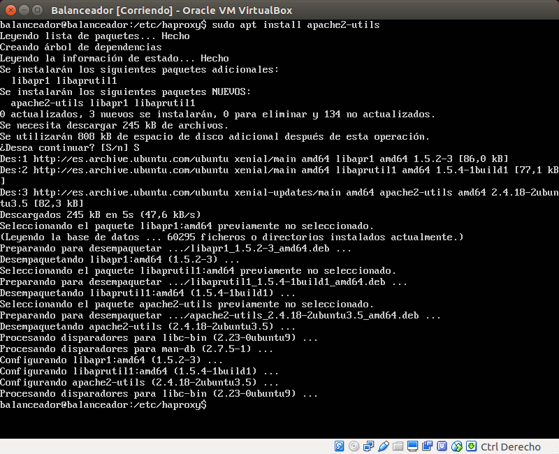

# Práctica 3. Balanceo de carga #

## Universidad de Granada - ETSIIT ##
### Servidores Web de Altas Prestaciones ###

### Participantes ###

- Raúl Del Pozo Moreno
- Manuel Mesas Gutiérrez

### Índice ###

1. [Descripción](#id1)
2. [Crear y configurar el balanceado](#id2)
3. [Nginx](#id3)
4. [HAProxy](#id4)
5. [Pound](#id5)
6. [Prueba Apache Benchmark y conclusiones](#id6)

---

### 1 - Descripción 

En esta práctica solucionaremos la sobrecarga de servidores mediante el balanceo de la carga.
Para ello probaremos tres soluciones software, **Nginx**, **HAProxy** y **Pound**.  
En esta práctica configuraremos una red entre varias máquinas de forma que
tengamos un balanceador que reparta la carga entre varios servidores finales.

**El balanceador será una nueva máquina que se encargará de redirigir las peticiones.**

___

### 2 - Crear y configurar el balanceador 

Creamos la máquina en VirtualBox y la conectamos a una red Sólo-Anfitrión de VirtualBox.

El siguiente paso es crear la interfaz de red nueva en el balanceador, para ello, iniciamos la maquina virtual y una vez logueados en el sistema escribimos el siguiente comando:

    sudo vim /etc/network/interfaces

Editamos el archivo para crear la interfaz.

___

### 3 - Nginx

#### 3.1 - Inslación Nginx:

Instalamos Nginx ejecutando el siguiente comando:

    sudo apt-get install nginx

Para comprobar que Nginx está activo, accedemos desde el Navegador de la máquina anfitrión a la dirección ip del balanceador.

#### 3.2 - Configuración Nginx:

Primero abrimos el archivo de configuración por defecto de Nginx usando el siguiente comando

    sudo vim /etc/nginx/conf.d/default.conf

En la primera sección, "upstream", de la configuración, definimos qué máquinas formarán el cluster web.
Para ello indicamos las IP de todos los servidores finales de nuestra granja web.

En la sección "server" indicamos qué puertos están a la escucha de los servidores Apache.
También es importante para que el proxy_pass funcione correctamente que indiquemos que la conexión entre Nginx y los servidores finales sea HTTP 1.1. Además tenemos que especificarle que debe eliminar la cabecera Connection (escribiendo " ") para evitar que se pase al servidor final la cabecera que indica el usuario.

Además debemos indicar en el archivo de configuración de Nginx que use nuestra configuración anteriormente descrita y que Nginx no actúe como servidor y solo lo haga como balanceador.
Para ello ejecutamos el siguiente comando:

    sudo vim /etc/nginx/nginx.conf

Tenemos que descomentar la línea "#include /etc/nginx/conf.d/\*.conf".

#### 3.3 - Comprobar funcionamiento de Nginx:

Ahora probamos el balanceador desde la máquina anfitrión usando el comando "curl" a la dirección del balanceador.

#### 3.4 - Cambiando opciones de Nginx:

El balanceo anterior lo hemos hecho sin priorizar ninguna máquina. Ahora usaremos pesos para priorizar la máquina 192.168.56.105. Para ello usaremos "weight".

Comprobamos desde la máquina anfitrión que en nuestro caso, de cada 3 peticiones al balanceador,
- Dos las manda a 192.168.56.105
- Una la manda a 192.168.56.115

Nos  interesa  que  todas  las  peticiones  que vengan de la misma IP se dirijan a la misma máquina servidora final para poder mantener el estado durante la navegación y que no se produzcan errores
para el usuario.

Para  evitarlo,  podemos  hacer  un  balanceo  por  IP,  de  forma  que  todo  el  tráfico  que venga de una IP se sirva durante toda la sesión por el mismo servidor final. Para ello usamos la directiva "ip_hash" en "upstream".

Comprobamos que el servidor nos mantiene en la misma máquina.

Para finalizar, establecemos que la máquina 2 actúe de backup de la primera en caso de que falle ésta.

Ahora comprobamos su funcionamiento:

1.  Con las dos máquinas en funcionamiento, el balanceador nos redirige a la "Máquina 1".

2.  Sin embargo, cuando apagamos la "Máquina 1", el balanceador no la detecta y nos manda al backup, en este caso, la "Máquina 2".

#### 3.5 - Parar servicio Nginx:

Para parar el servicio simplemente ejecutamos:

    sudo service nginx stop

___

### 4 - HAProxy 

#### 4.1 - Instalación HAProxy:

Instalamos HAProxy ejecutando el siguiente comando:

    sudo apt-get install haproxy

#### 4.2 - Configuración HAProxy:

Abrimos el archivo de configuración de HAProxy usando el siguiente comando

    sudo vim /etc/nginx/conf.d/default.conf

Debemos modificarlo de la siguiente forma para que use el puerto 80 de nuestras dos máquinas y escuche por el puerto 80 del propio balanceador.

Además debemos quitar las líneas "contimeout", "clitimeout" y "srvtimeout", pues están desfasadas, y debemos usar en su lugar "timeout connect", "timeout client" y "timeout server" respectivamente.

Si no se quitan estas líneas obtenemos los siguientes Warnings.

#### 4.3 - Comprobar funcionamiento HAProxy:

Comprobamos su funcionamiento desde la máquina anfitrión usando el comando curl al balanceador.

#### 4.4 - Parar servicio HAProxy:

A diferencia de Nginx, no es posible parar el servicio HAProxy ejecutando:

    sudo service haproxy stop

Podemos comprobarlo con la siguiente orden:

    sudo netstat -tulpn | grep :80

Que nos muestra que HAProxy sigue activo escuchando en el puerto 80.

Para parar el servicio tenemos que ejecutar:

    sudo pkill haproxy

Y comprobamos que efectivamente HAProxy se ha detenido.

___

### 5 - Pound. Balanceador Extra

#### 5.1 - Inslatación Pound:

Instalamos Pound ejecutando el siguiente comando:

    sudo apt-get install pound

#### 5.2 - Configuración Pound:

Abrimos el archivo de configuración de Pound usando el siguiente comando

    sudo vim /etc/pound/pound.cfg

Debemos modificarlo de la siguiente forma para que use el puerto 80 de nuestras dos máquinas y escuche por el puerto 80 del propio balanceador.

Comprobamos que efectivamente pound está escuchando por el puerto 80.

#### 5.3 - Comprobar funcionamiento Pound:

Comprobamos su funcionamiento desde la máquina anfitrión usando el comando curl al balanceador.

___

### 6 - Prueba Apache Benchmark y conclusiones 

#### 6.1 - Instalación Apache Benchmark:

Instalamos AB ejecutando el siguiente comando:

    sudo apt-get install apache2-utils

Para utilizar Apache Benchmark debemos ejecutar el siguiente comando:

    ab -n 1000 -c 10 http://192.168.2.125/index.html

Los parámetros indicados en la orden anterior le indican al benchmark que solicite la página  con dirección  http://192.168.2.125/index.html  1000  veces  (-n  1000  indica  el número  de  peticiones) y  hacer  esas  peticiones  concurrentemente  de  10  en  10  (-c  10 indica el nivel de concurrencia).

La IP es la de nuestro balanceador.

Realizaremos 3 pruebas por cada software

#### 6.2 - Prueba Apache Benchmark en Nginx:

#### 5.3 - Comprobar funcionamiento HAProxy:

#### 5.4 - Comprobar funcionamiento Pound:

#### 6.5 - Conclusiones:

Los tres softwares se comportan de forma similar como balanceadores.
