# Práctica 4. Asegurar una granja web #

## Universidad de Granada - ETSIIT ##
### Servidores Web de Altas Prestaciones ###

### Participantes ###

- Raúl Del Pozo Moreno
- Manuel Mesas Gutiérrez

### Índice ###

1. [Objetivos de la práctica](#id1)
2. [Instalar un certificado SSL autofirmado para configurar el acceso por HTTPS](#id2)
3. [Configuración del cortafuegos](#id3)
4. [Opcional 1 - Certbot](#id4)
5. [Opcional 2 - Firewall](#id5)
6. [ANEXO](#id6)

___

### 1 - Objetivos de la práctica

El objetivo de esta práctica es llevar a cabo la configuración de seguridad de la granja
web. Para ello, llevaremos a cabo las siguientes tareas:

- Instalar un certificado SSL para configurar el acceso HTTPS a los servidores.
- Configurar las reglas del cortafuegos para proteger la granja web.
- Instalación de un certificado del proyecto Certbot.
- Configuración de un firewall en una máquina externa al balanceador.

___

### 2 - Instalar un certificado SSL autofirmado para configurar el acceso por HTTPS

Para realizar esta parte de la práctica, necesitamos habilitar el módulo SSL de Apache2 en las máquinas servidoras y en la maquina balanceadora. También necesitamos crear nuestros certificados autofirmados, los cuales deben ser los mismos en las tres máquinas.

#### 2.1 Generar certificado autofirmado

Para generar un certificado autofirmado, primero debemos activar el módulo SSL de Apache y reiniciar el servicio de Apache:

    sudo a2enmod ssl
    sudo service apache2 restart

El siguiente paso es crear una carpeta la cual contendrá los certificados, esta carpeta se llamará ssl y estará dentro de la carpeta de apache.

    sudo mkdir /etc/apache2/ssl

A continuación, vemos los comandos ejecutados en la máquina servidora 1:

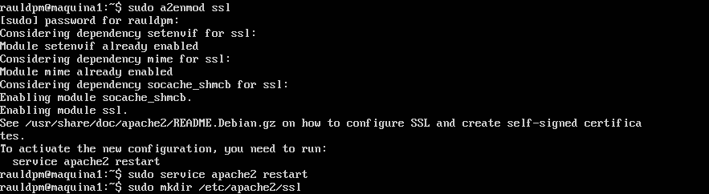

De esta forma, el siguiente paso será generar el certificado, el cual lo crearemos usando la herramienta **openssl**.

    sudo openssl req -x509 -nodes -days 365 -newkey rsa:2048 -keyout /etc/apache2/ssl/apache.key -out /etc/apache2/ssl/apache.crt

La ejecución del comando anterior, genera una serie de campos que habremos de rellenar, como son el nombre del país, la ciudad, la organización a la que pertenece el certificado, el nombre y el correo electrónico para configurar el dominio:

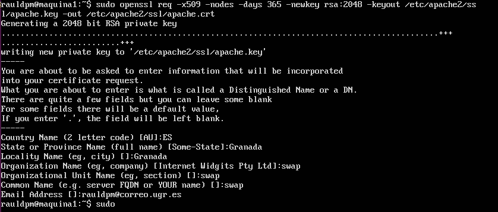

#### 2.2 Instalar certificado autofirmado

Una vez que se han generado los archivos de certificado **.key** y **.crt**, debemos activar en la configuración del servidor la configuración ssl.

Para ello. debemos editar el archivo de configuración default-ssl de apache:

    sudo vim /etc/apache2/sites-available/default-ssl

y añadir las siguientes líneas debajo de **SSL Engine Switch**.

    SSLCertificateFile /etc/apache2/ssl/apache.crt
    SSLCertificateKeyFile /etc/apache2/ssl/apache.key

#### 2.3 Habilitar SSL en Apache y Nginx

Ahora que ya tenemos todo preparado para SSL, el último paso es habilitar el sitio **default-ssl** mediante los comandos:

    sudo a2ensite default-ssl
    sudo service apache2 reload

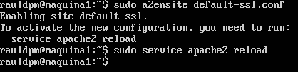 

Una vez hecho esto, ya tenemos el acceso por http y https en una máquina servidora, en concreto la uno, así que para la segunda máquina servidora se repite todo este proceso pero sin crear los certificados.

Adicionalmente, como tenemos configurado un balanceador, debemos transferir los certificados a dicha máquina y habilitar en Nginx (balanceador) el certificado ssl.

Para transferir los certificados podemos usar la herramienta **rsync** o **scp**, en este caso se han transferido mediante **scp**, primero desde la máquina servidora dos y luego desde la maquina balanceadora con los siguientes comandos:

    sudo scp rauldpm@192.168.56.105:/etc/apache2/ssl/* /etc/apache2/ssl/ (desde máquina 2)
    sudo scp rauldpm@192.168.56.105:/etc/apache2/ssl/* /etc/nginx/ssl/ (desde balanceador)

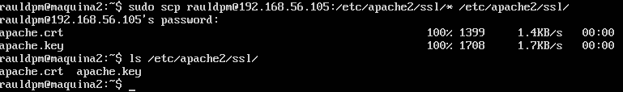
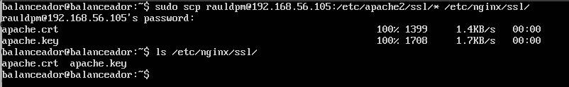 

Como último paso, tenemos que habilitar **ssl** en Nginx, para ello, tendremos que crear un archivo llamado **ssl-conf** en la carpeta de configuración de Nginx e introducir el siguiente código:

    sudo vim /etc/nginx/conf.d/ssl.conf

En dicho archivo, hacemos una copia del archivo **default.conf**, el cual contiene la configuración **http** y **las direcciones IP a balancear**.

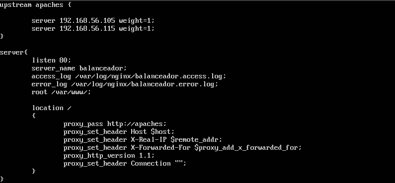 

Pero en este caso, para el archivo **ssl.conf**, no necesitamos las IP que se balancean porque ya están definidas, y en vez de la configuración **http** se pone la configuración para **https**, donde se indica:

- el puerto de escucha:&nbsp;**listen 443 ssl**
- el estado del ssl   :&nbsp;**ssl on**
- la ruta donde buscará el certificado crt:&nbsp;**/etc/nginx/ssl/apache.crt**
- la ruta donde buscará el certificado key:&nbsp;**/etc/nginx/ssl/apache.key**

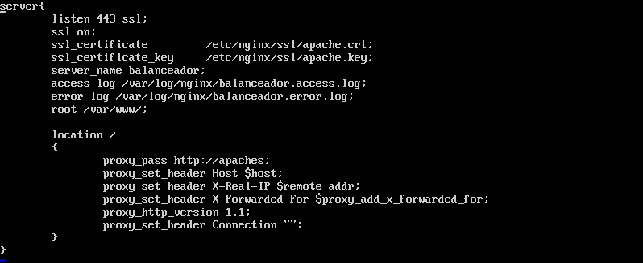 

El resto del archivo es común para ambos archivos de configuración.
Ahora si accedemos directamente a las máquinas servidoras, nos hará la conexión por http y https, además, si hacemos la conexión a través del balanceador, también nos servirá por ambos protocolos.

**Maquina uno a través de http y https**
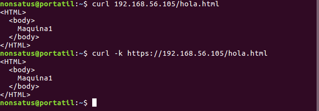

**Maquina dos a través de http y https**
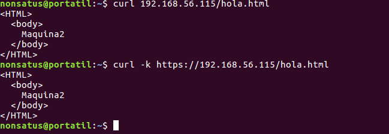

**Balanceo a través de http y https** 
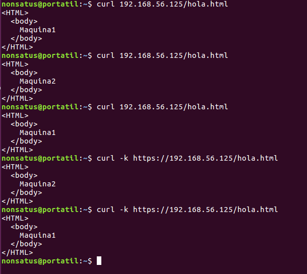

___

### 3 - Configuración del cortafuegos

En este punto de la práctica, vamos a proteger las máquinas servidoras mediante el uso de iptables, permitiendo solamente las conexiones a través de los puertos **80 (http)**,**443 (https)** y **22 (ssh)**.

Para ellos, nos hemos creado dos scripts, el primer script llamado **iptablesInicio.sh** que se encarga de crear las reglas del cortafuegos y otro script llamado **iptablesReset.sh** que se encarga de eliminar toda la configuración de iptables que tenga el sistema.

**Script iptablesReset.sh**
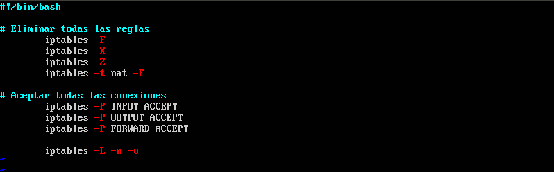 

**Script iptablesInicio.sh**
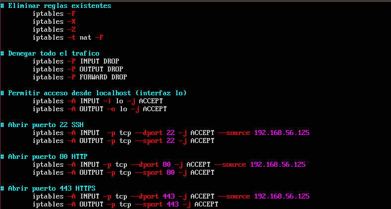 

Como podemos ver en la imagen superior, el script consta de varias partes:
- Eliminación de reglas existentes
- Denegación de todo el tráfico
- Permitir acceso desde localhost
- Apertura de puertos **80**, **443**, **22**

Es importante destacar, que a la hora de abrir los puertos, debemos indicar la fuente desde donde recibe la conexión, en este caso, se indica mediante **--source 192.168.56.125**, en la orden de entrada, que corresponde con la maquina balanceadora.

Una vez hecho esto, si alguien intenta conectar directamente con la máquina servidora uno o dos, recibirá un error **tiempo de espera excedido**, permitiendo solo la conexion a traves del balanceador.

Si vemos las reglas de iptables creadas al ejecutar el script **iptablesInicio.sh**, veremos lo siguiente, donde podremos observar que tanto para las conexiones de entrada como las de salida, están abiertos los puertos **80**, **443** y **22** por **tcp**:

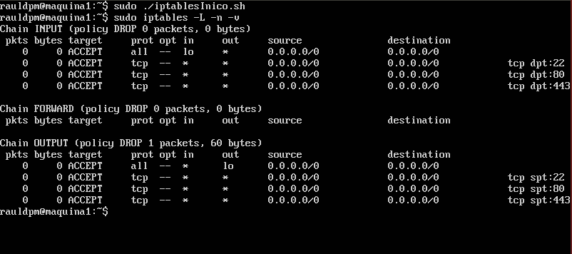 

Como podemos ver en la imagen siguiente, las conexiones directas las rehúsa, mientras que las del balanceador las acepta, tanto por http como por https:

**Curls cortafuegos.sh** 
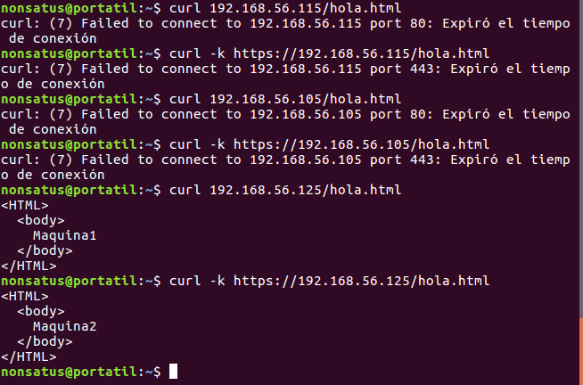 

Por último, debemos hacer que el script que crea las reglas se ejecute cada vez que la máquina se enciende, ya que no se quedan guardadas. Para ello, tenemos que editar el archivo **rc.local** y añadirle la ruta al script.

    sudo vim /etc/rc.local

**Archivo rc.local**
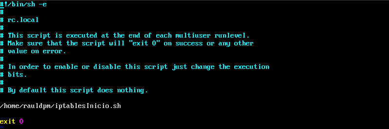 

Una vez hecho esto, la próxima vez que iniciemos el sistema, podremos observar en el arranque, la creación de las tablas:

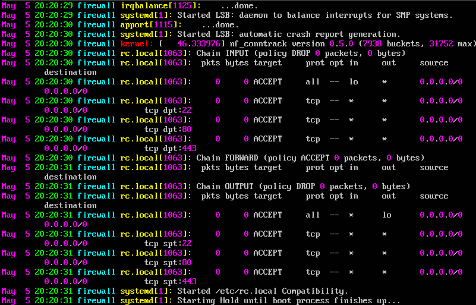
___

### 4 - Opcional 1 - Certbot

#### 4.1 - Descripción Certbot

Certbot es un cliente [ACME](https://en.wikipedia.org/wiki/Automated_Certificate_Management_Environment) automático y fácil de utilizar, que obtiene certificados SSL/TLS gratis para tu sitio Web, provistos por Let's Encrypt.

Requiere que nuestra web tenga una IP pública y estática. Por lo tanto, Certbot no puede usarse en una máquina virtual, ni en localhost.

#### 4.2 - Instalar Certbot

##### 1º Añadimos el respositorio:

    sudo add-apt-repository ppa:certbot/certbot

##### 2º Actualizamos los repositorios:

    sudo apt update

##### 3º Instalamos el cliente Certbot:

    sudo apt install python-certbot-apache

#### 4.3 - Instalar el certificado SSL

Para instalar el certificado en nuestro dominio deberemos ejecutar el siguiente comando:

    sudo certbot --apache -d mi-dominio-ejemplo.com

Donde **mi-dominio-ejemplo.com** es nuestro dominio.

Si tenemos subdominios deberemos ejecutar el comando con una segunda opción -d, y deberemos de poner una lista de los subdominios, siendo el primero el dominio base, tal y como se muestra a continuación:

    sudo certbot --apache -d mi-dominio-ejemplo.com -d mi-dominio-ejemplo.com subdominio1.mi-dominio-ejemplo.com subdominio2.mi-dominio-ejemplo.com

Cuando finalice la instalación, debería poder encontrar los archivos de certificado generados en `/etc/letsencrypt/live` . Puede verificar el estado de su certificado SSL con el siguiente enlace:

https://www.ssllabs.com/ssltest/analyze.html?d=mi-dominio-ejemplo.com&latest

#### 4.4 - Verificar la renovación automática de Certbot

Los certificados Let's Encrypt solo duran 90 días. Sin embargo, el paquete Certbot que instalamos se encarga de esto ejecutando `certbot renew` dos veces al día a través de un temporizador systemd. En las distribuciones no incluidas en el sistema, esta funcionalidad es proporcionada por un script cron ubicado en `/etc/cron.d`. Podemos comprobar que no hay errores en la renovación ejecutando el siguiente comando:

    sudo certbot renew --dry-run

Si no aparece ningún mensaje de error, Certbot está completamente listo.

___

### 5 - Opcional 2 - Firewall

En esta parte opcional, vamos a configurar una máquina para que actúe como cortafuegos, esto se puede hacer directamente en la máquina balanceador, pero nos ha parecido más correcto, tener una máquina específicamente para esto.

Esta nueva máquina no tiene ningun servidor instalado, no sirve nada, simplemente redirige el tráfico que le entra por determinados puertos, hacia los puertos de la máquina balanceadora, filtrando conexiones indeseadas.

**LA NUEVA MAQUINA TIENE LA IP 192.168.56.135**

Para realizar esto, se creará un script con órdenes iptables que harán el enrutamiento.

Igual que en las máquinas servidoras, se han creado dos scripts, uno para resetear la configuracion de iptables y otro para crear las reglas.

A continuación vemos el contenido del script que crea las reglas:

**Script Opcional Firewall**
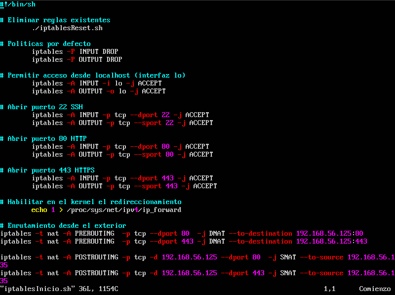 

La estructura del fichero es la misma que los scripts de las máquinas servidoras, solo que en este caso, en vez de usar iptables para eliminar las reglas que puedan existir, se llama al script **iptablesReset.sh**.

También se han eliminado en la apertura de puertos, que acepte solo las conexiones de una sola ip, permitiendo ahora las conexiones desde cualquier ip entrante.

Adicionalmente, se han añadido una serie de órdenes para permitir y crear el enrutamiento.

Para habilitar el enrutamiento se ha utilizado el comando echo de la siguiente manera, el cual cambia el valor de ip_forward a true:

    sudo echo 1 > /proc/sys/net/ipv4/ip_forward

Para las conexiones entrantes, se ha utilizado la opción **PREROUTING** la cual envía la conexión a una ip (en este caso la del balanceador) a través de un puerto deseado:

    iptables -t nat -A PREROUTING -p tcp --dport 80 -j DNAT --to-destination 192.168.56.125:80
    iptables -t nat -A PREROUTING -p tcp --dport 443 -j DNAT --to-destination 192.168.56.125:443

Y para las conexiones salientes, se ha utilizado POSTROUTING, la cual coge la conexión de una ip (la del balanceador) y se la envía a sí misma a través del puerto deseado:

    iptables -t nat -A POSTROUTING -p tcp -d 192.168.56.125 --dport 80 -j SNAT --to-source 192.168.56.135
    iptables -t nat -A POSTROUTING -p tcp -d 192.168.56.125 --dport 443 -j SNAT --to-source 192.168.56.135

Un ejemplo de cómo funciona el enrutamiento, podríamos verlo en la siguiente imagen:

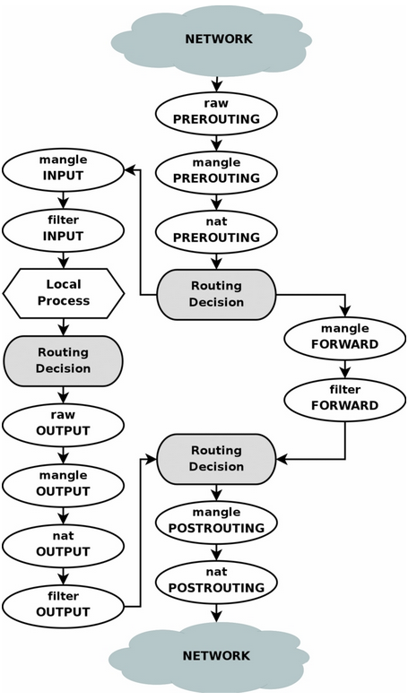 

Para finalizar, comprobamos desde el anfitrión, la conexión a través de la máquina con el firewall, y como podemos ver: recibimos el balanceado de las máquinas servidoras.

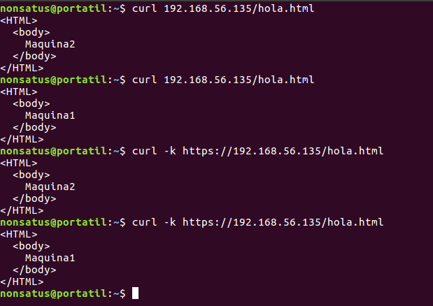 

### 6 - ANEXO

Queremos aclarar, que según la configuración opcional del firewall en una nueva máquina, las conexiones directas a la máquina balanceadora deberán ser rechazadas, al igual que las máquinas servidoras rechazan las conexiones directas.

Esto lo hemos intentado realizar mediante iptables, aceptando sólo las conexiones desde la máquina con el firewall, pero por algún motivo, creemos que nginx necesita algún tipo de configuración extra (sopesamos que pueda ser cosa de ipv6 o algún puerto extra que necesite ser abierto) no hemos conseguido hacerlo y por eso en el apartado opcional del firewall no se ha nombrado dicha configuración para la maquina balanceadora.

Además, aunque hemos instalado Certbot, no podemos instalar ningún certitificado porque no poseemos un dominio en una IP pública y estática.

___
