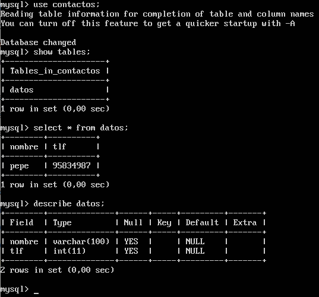

# Práctica 5. Replicación de bases de datos MySQL#

## Universidad de Granada - ETSIIT ##
### Servidores Web de Altas Prestaciones ###

### Participantes ###

- Raúl Del Pozo Moreno
- Manuel Mesas Gutiérrez

### Índice ###

1. [Objetivos de la práctica](#id1)
2. [Crear un tar con ficheros locales y copiarlos en un equipo remoto](#id2)
3. [Crear una BD e insertar datos](#id3)
4. [Replicar una BD MySQL con mysqldump](#id4)
5. [Replicación de BD mediante una configuración maestro-esclavo](#id5)
6. [EXTRA: Replicación de BD mediante una configuración maestro-maestro](#id6)

___

### 1 - Objetivos de la práctica

Los objetivos de esta práctica son:
- Copiar archivos de copia de seguridad mediante ssh.
- Clonar manualmente BD entre máquinas.
- Configurar la estructura maestro-esclavo entre dos máquinas para realizar el
clonado automático de la información.
___

### 2 - Crear un tar con ficheros locales y copiarlos en un equipo remoto

Debemos indicar al comando tar que queremos que use la salida estándar como destino y mandarle a través de un pipe la salida a ssh, que debe coger la salida de tar y escribirla en un fichero.
Para ello ejecutaremos el siguiente comando.

    tar czf - nombreDirectorio | ssh nombreEquipoDestino 'cat > ~/tar.tgz'

___

### 3 - Crear una BD e insertar datos

Para crear la BD, tenemos dos opciones. Ejecutar comando a comando, o en nuestro caso, crear un script de comandos que podremos reutilizar, `bd.sql`.

El contenido del script es el siguiente:

Los pasos del script son:

  - 1. Creamos la base de datos con nombre `contactos`.
  - 2. En `contactos` creamos la tabla `datos`, con las variables `nombre` y `tlf`.
  - 3. Insertamos los datos `pepe` en `nombre` y `95834987` en `tlf`.

Aquí podemos comprobar la salida al ser ejecutado:

A continuación vamos a usar nuestra base de datos `bd.sql` para ver los datos de forma mas exhaustiva:

___

### 4 - Replicar una BD MySQL con mysqldump

Para este ejercicio vamos a usar la herramienta mysqldump.
Para evitar que la copia de los archivos sea problemática para los usuarios, ya que estos pueden estar usando los mismos archivos que se copian, debemos evitar evitar que se ejecuten cambios en la base de datos antes de copiarlos, una vez que hayamos hecho la copia, podremos volver a activarla.

Como podemos ver en la siguiente imagen, primero se ha desactivado el acceso a la base de datos mediante el comando

    mysql -u root -p -e "FLUSH TABLES WITH READ LOCK;"

Una vez desactivado, importamos la base de datos a un archivo .sql mediante:

    mysqldump (nombre bd) -u (usuario) -p > (archivo)
    mysqldump contactos -u root -p > copia.sql

Ahora solo faltaría reactivar el acceso a la base de datos mediante:

    mysql -u root -p -e "UNLOCK TABLES;"

Finalmente, una vez que tenemos la base de datos importada, la enviamos a la carpeta de usuario de la otra máquina (**192.168.56.155**).

    scp copia.sql rauldpm@192.168.56.155:/home/rauldpm/

Una vez que tenemos la base de datos importada a la otra maquina, solo nos quedaría crear la base de datos en la nueva máquina e importar los datos (la base de datos tiene que llamarse igual).

Primero, creamos la bd:

    mysql -u root -p -e "CREATE DATABASE contactos;"

Segundo, importamos los datos:

    mysql -u root -p (nombre bd) < (archivo)
    mysql -u root -p contactos < copia.sql

Finalmente, entramos en mysql, indicamos que usemos la base de datos que acabamos de insertar y mostramos el contenido.

    mysql -u root -p
      use contactos;
      describe datos;

___

### 5 - Replicación de BD mediante una configuración maestro-esclavo

Antes de nada, mysql usa el puerto 3306 para las comunicaciones, así que si tenemos un firewall activado tendremos que abrir dicho puerto.

Ahora se va a realizar una configuración que automatice el clonado de la base de datos desde una base de datos principal. De esta forma, todos los cambios realizados desde la base de datos principal, se replicarán en la base de datos secundaria.

Para empezar, debemos realizar la configuración de la base de datos principal (maestro) modificando el archivo de configuración de mysql:

    sudo vim /etc/mysql/mysql.conf.d/mysql.cnf

Y editamos las siguientes líneas de la siguiente forma:

    bind-address 127.0.0.1 por #bind-address 127.0.0.1
    server-id = 1
    log_bin = /var/log/mysql/bin.log

Similarmente, en la base de datos esclava, haremos las mismas configuraciones salvo que en la línea de server-id pondremos:

    server-id = 2

Una vez hayamos realizado esta configuración en ambas máquinas, debemos reiniciar el servicio mediante:

    sudo service mysql restart

El siguiente paso, es crear el usuario en la base de datos master, para ello entramos a la base de datos mediante:

    mysql -u root -p

Una vez dentro de la base de datos, creamos al usuario mediante la sentencia **CREATE**:

    CREATE USER esclavo IDENTIFIED BY 'esclavo';

Damos permisos al usuario:

    GRANT REPLICATION SLAVE ON *.* TO 'esclavo'@'%' IDENTIFIED BY 'esclavo';
    FLUSH PRIVILEGES;
    FLUSH TABLES;

Desactivamos el acceso a las tablas mientras configuramos el esclavo:

    FLUSH TABLES WITH READ LOCK;

Una vez que ya hemos configurado la base de datos en el maestro, obtenemos los datos para usarlos en la configuración del esclavo, donde deberemos anotar **FILE** y **POSITION**:

    SHOW MASTER STATUS;

Ahora, en la máquina esclava, configuramos la base de datos para que pueda acceder al maestro:

    CHANGE MASTER TO MASTER_HOST='IP MAESTRO', MASTER_USER='esclavo', MASTER_PASSWORD='esclavo', MASTER_LOG_FILE='FILE OBTENIDO DE LA OTRA BD', MASTER_LOG_POS=POSITION DE LA OTRA BD, MASTER_PORT=3306;

    CHANGE MASTER TO MASTER_HOST='IP 192.168.56.145', MASTER_USER='esclavo', MASTER_PASSWORD='esclavo', MASTER_LOG_FILE='mysql-biz.000001', MASTER_LOG_POS=980, MASTER_PORT=3306;

Iniciamos el esclavo en la base de datos esclava:

    START SLAVE;

Activamos las tablas en el maestro:

    UNLOCK TABLES;

Y si realizamos algún cambio en la base de datos maestra, estos se replicarán al esclavo inmediatamente:

___

### 6 - EXTRA: Replicación de BD mediante una configuración maestro-maestro

Adicionalmente, hemos realizado la configuración maestro-maestro a partir de una configuración maestro-esclavo.

Para ello, hemos realizado los siguientes pasos:

En la base de datos esclava, hemos creado un usuario llamado **maestro**, recordemos, que en la máquina maestra tenemos un usuario **esclavo**.

Una vez creado el usuario, se le aplican los permisos tal y como hicimos en el punto 5.

Hecho esto, tenemos que irnos a la máquina maestra y cambiar el máster de la siguiente forma:

    CHANGE MASTER TO MASTER_HOST='192.168.56.155', MASTER_USER='maestro', MASTER_PASSWORD='maestro', MASTER_LOG_FILE='mysql-bin.000001', MASTER_LOG_POS=706, MASTER_PORT=3306;

Reiniciamos el servicio y si añadimos algo a la base de datos de cualquiera de las dos máquinas, podremos ver que en la otra maquina tambien se añade.

___
